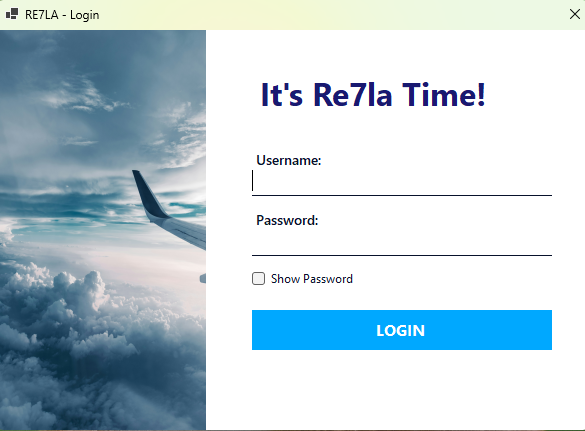
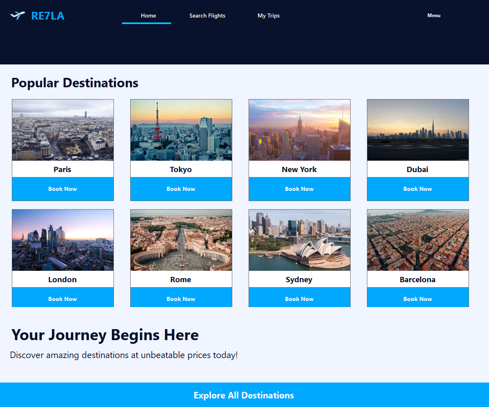
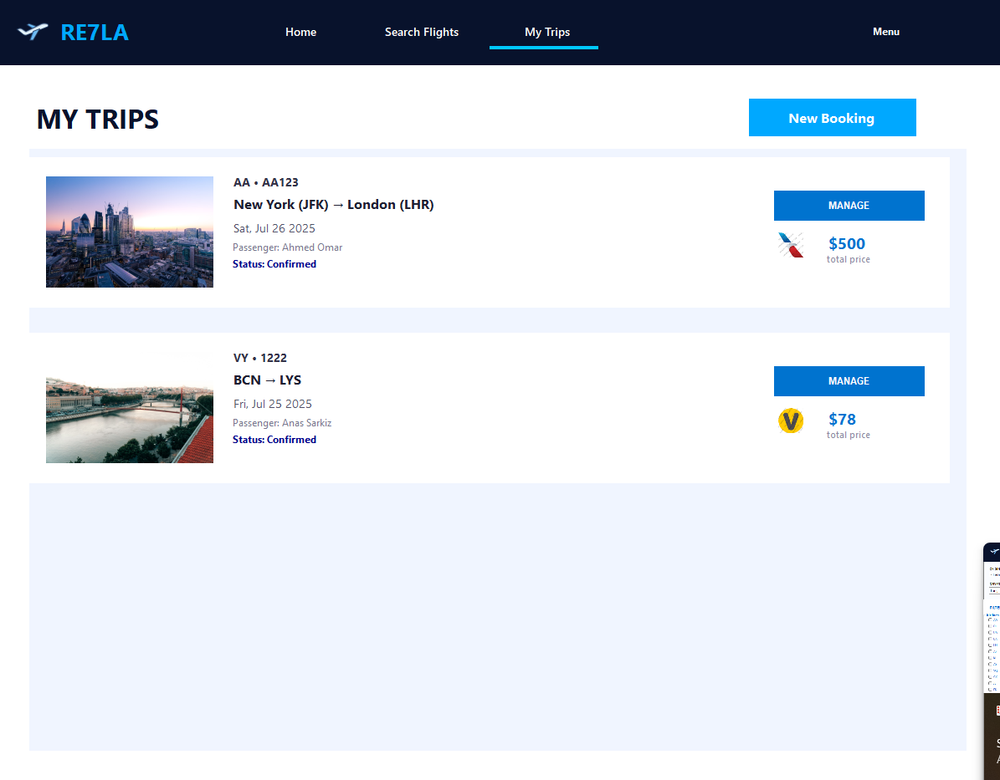
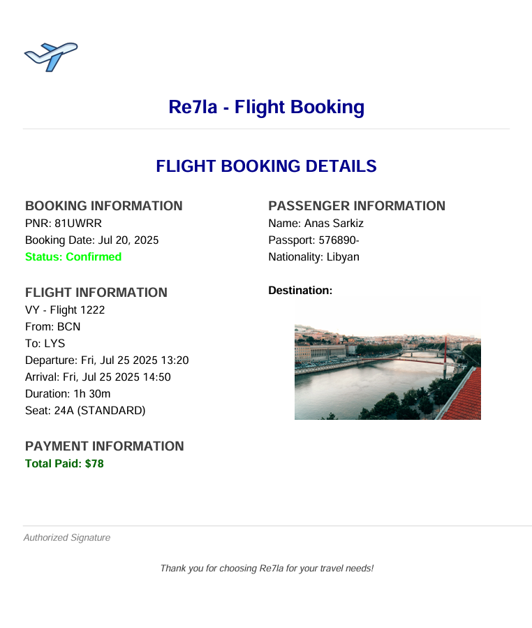

# ✈️ Flight Booking System

A professional, desktop-based Flight Booking System built using **C# WinForms**, providing a seamless and intuitive interface for searching, booking, and managing flight reservations. This project is ideal for educational purposes, small-scale deployment, or as a base for more advanced airline booking applications.

## 📌 Features

* 🔍 **Flight Search**: Search available flights by origin, destination, and date.
* 🧭 **Smart Filtering**: Filter results by airline, price, flight class (economy/business), and trip duration.
* 🎟️ **Booking Interface**: Enter traveler information, select seats, choose class, and view pricing before confirmation.
* 💳 **Integrated Payment Panel**: Seamless interface to process payments during booking.
* 📩 **Contact Us**: Allows users to send inquiries or feedback via the built-in messaging system.
* 🛂 **Admin Dashboard**: Manage flights, bookings, and users via a clean, centralized panel.
* 📄 **PDF Ticket Generation**: Generate a well-structured PDF ticket after successful booking.
* 🌍 **Airport Autocomplete**: Utilizes [MWGG Airports JSON](https://github.com/mwgg/Airports) for dynamic airport search suggestions.
* 🌐 **Modernized UI**: Consistent layout with FontAwesome icons and sleek modern design.

## 🖥️ Screenshots
* ***Login:***

 

* ***Home Page:***



* ***Flight Search:***

 

 * ***My Trips:***
	
 

* ***Generated PDF:***




## 🏗️ Tech Stack

* **Language:** C#
* **Framework:** WinForms (.NET Framework)
* **UI:** FontAwesome.Sharp for icons and UI enhancements
* **Data:** JSON files (for airport data), in-memory objects (extendable to database)
* **Architecture:** Layered architecture using Services, Models, and UserControls

## 🧾 Project Structure

```
Flight-Booking-System/
├── Controls/           # Custom UI elements (SearchBox, FilterPanel, BookingForm, etc.)
├── Models/             # Core data models (Flight, Booking, User, ContactMessage, etc.)
├── Services/           # Business logic and data management
├── Forms/              # Application windows and user interface
├── Assets/             # Icons, logos, and style assets
├── docs/screenshots/   # UI screenshots for documentation
├── Program.cs          # Main entry point
└── README.md
```

## 🚀 Getting Started

### Prerequisites

* Visual Studio 2022 or later
* .NET Framework (matching version used in the project)
* Git (to clone the repository)

### Steps to Run

1. Clone the repository:

   ```bash
   git clone https://github.com/AnasSarkiz/Flight-Booking-System.git
   ```
2. Open the solution (`.sln`) file in Visual Studio.
3. Restore NuGet packages if needed.
4. Press **Start** or `Ctrl+F5` to build and run the project.

## 🧪 Future Improvements

* ✅ Database integration (SQL Server / SQLite)
* ✅ Authentication & Role-based Access Control
* ✅ REST API layer for backend logic
* ✅ Real-time flight data with APIs like AviationStack or Amadeus
* ✅ Seat selection UI improvements
* ✅ Enhanced PDF ticket styling and QR code support

## 🤝 Contributing

Pull requests are welcome! If you have suggestions, bugs, or ideas, feel free to open an issue first.

Steps to contribute:

1. Fork the repository
2. Create a new branch (`git checkout -b feature/my-feature`)
3. Make your changes
4. Commit (`git commit -m "Added new feature"`)
5. Push your changes (`git push origin feature/my-feature`)
6. Open a Pull Request

## 📝 License

This project is licensed under the [MIT License](LICENSE).

## 📧 Contact

Developed by [**Anas Sarkiz**](https://github.com/AnasSarkiz)

If you found this project useful, feel free to star ⭐ the repository and share feedback!
